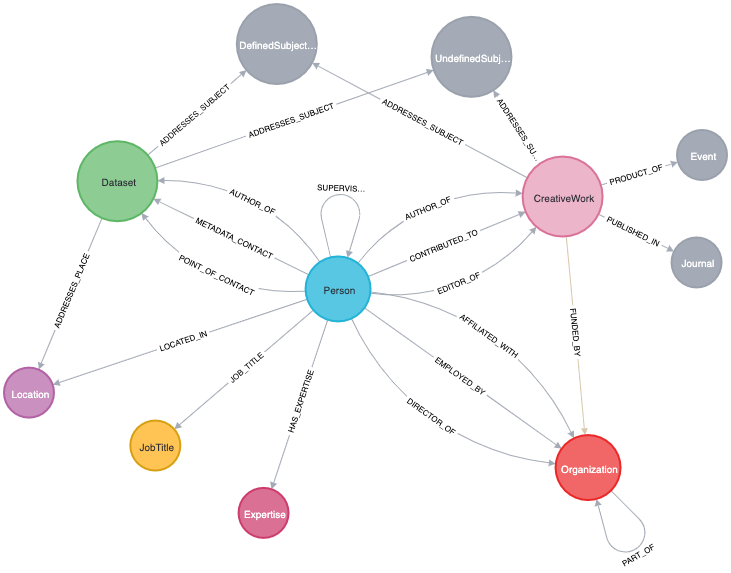

# iSAID (integrated Science Assessment Information Database)

One of the ideas driving the design of pyLinkedCMD is the development of a mechanism for characterizing and assessing integrated science capacity. To do this, we needed to develop a new type of database that, literally, connects the dots between all of what are functionally disconnected catalogs. Through the iSAID idea, we've experimented with several different structures for this concept and settled on building a graph database in Neo4j. The set of notebooks here are a work in progress toward formalizing the workflow to build this graph from source material, from which we can then build many other routes into the information from simple tables/dataframes to tailored search indexes. We are slowly working the code that executes the graph building logic back into the pylinkedcmd modules themselves as we get it all refined to work the way we need.

# Current Graph

# Limitations

You will not be able to run everything that is in these workflows without setting up some configuration elements. You need environment variables pointing to a Neo4j instance that you want to use (local or cloud). Some source material also currently comes from a prototype API and processing framework we are using to run routinely and keep sources up to date that are either not accessible via their own APIs or have unstable APIs we can't count on. Access to that API is currently restricted but will be made public eventually. 