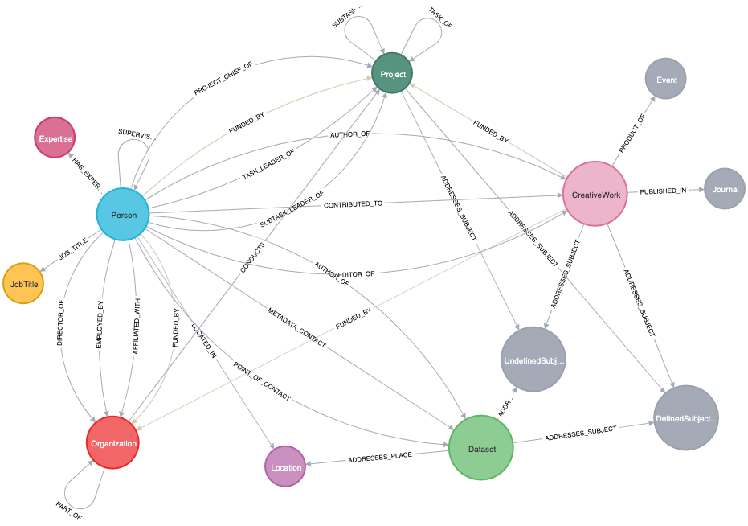

# iSAID (integrated Science Assessment Information Database)

One of the ideas driving the design of pyLinkedCMD is the development of a mechanism for characterizing and assessing integrated science capacity. To do this, we needed to develop a new type of database that, literally, connects the dots between all of what are functionally disconnected catalogs. Through the iSAID idea, we've experimented with several different structures for this concept and settled on building a graph database in Neo4j. The set of notebooks here are a work in progress toward formalizing the workflow to build this graph from source material, from which we can then build many other routes into the information from simple tables/dataframes to tailored search indexes. We are slowly working the code that executes the graph building logic back into the pylinkedcmd modules themselves as we get it all refined to work the way we need.

# Workflows

The major notebooks in this folder are organized into either data builders or graph builders. All of these are works in progress, and we'll make the notes better as we need to revisit the workflows in pursuit of use cases.

The "Build Data" notebooks handle the process of accessing source material and prepping information for incorporation into our graph. The logic for these will move into core pyLinkedCMD functionality as we continue refactoring that code. The data builders handle things like getting source material from sometimes picky or unstable APIs. More of these will move to live serverless processes as we can put time into building those out so we have stable sources maintained dynamically to work against.

The "Build Graph" notebooks execute Cypher queries against a Neo4j instance to build out nodes and relationships. After working through many different ways of getting data into the graph, we settled for a while on the expedient of writing and reading CSV files. We may go back to some of these processes working live against our intermediary APIs once we incorporate the data building and smoothing steps into that end of things. For now, slinging a few files around keeps things simple and lets us show and demonstrate fairly easy to understand information structures and concepts.

# Current Graph

# Limitations

You will not be able to run everything that is in these workflows without setting up some configuration elements. You need environment variables pointing to a Neo4j instance that you want to use (local or cloud). Some source material also currently comes from a prototype API and processing framework we are using to run routinely and keep sources up to date that are either not accessible via their own APIs or have unstable APIs we can't count on. Access to that API is currently restricted but will be made public eventually. 